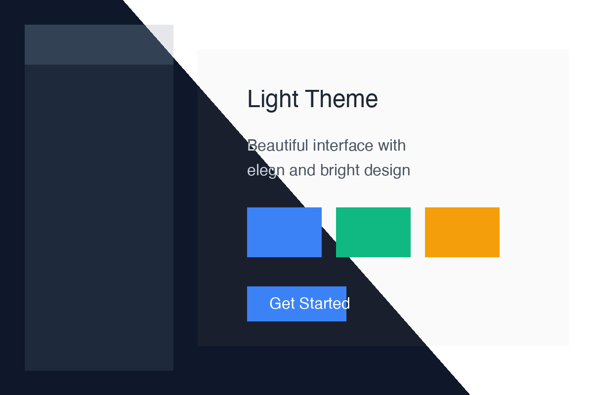

<div align="center">

# 🎨 Theme Merge

**A beautiful web tool for creating diagonal split comparisons of light and dark theme screenshots**

[](https://tageecc.github.io/theme-merge/)
[](https://github.com/tageecc/theme-merge/stargazers)
[](LICENSE)

[English](README.md) | [简体中文](README.zh-CN.md)

[🚀 Try it now](https://tageecc.github.io/theme-merge/) • [📖 Documentation](#features) • [💬 Feedback](https://github.com/tageecc/theme-merge/issues)

</div>

---

## ✨ Features

- **🖼️ Instant Preview** - See your images immediately as you upload them
- **🎯 Diagonal Split Effect** - Professional-looking theme comparison with adjustable angle
- **📐 Angle Control** - Fine-tune the split angle from -45° to 45°
- **📱 Fully Responsive** - Works perfectly on desktop and mobile devices
- **💾 High Quality Export** - Download merged images in original resolution
- **⚡ Zero Dependencies** - Pure HTML/CSS/JavaScript, runs entirely in your browser
- **🔒 Privacy First** - All processing happens locally, your images never leave your device
- **🎨 Click-to-Upload** - Intuitive interface - click left for light theme, right for dark theme

## 🎬 Demo



*Diagonal split comparison showing light theme (top-left) and dark theme (bottom-right)*

## 🚀 Quick Start

### Online Version (Recommended)

Simply visit **[https://tageecc.github.io/theme-merge/](https://tageecc.github.io/theme-merge/)** and start using it immediately!

### Local Development

1. Clone the repository
```bash
git clone https://github.com/tageecc/theme-merge.git
```

2. Open `index.html` in your browser
```bash
cd theme-merge
open index.html  # macOS
# or just double-click index.html
```

That's it! No build process, no dependencies to install.

## 📖 How to Use

1. **Upload First Image**
   - Click on the left side of the canvas to upload your light theme screenshot
   - The image will appear immediately for preview

2. **Upload Second Image**
   - Click on the right side to upload your dark theme screenshot
   - The diagonal merge effect will be applied automatically

3. **Adjust the Angle**
   - Use the slider to adjust the diagonal split angle
   - Real-time preview as you adjust

4. **Download Result**
   - Click the "Download Image" button
   - The merged image will be saved with the current date in the filename

## 🎯 Use Cases

Perfect for:
- 📱 **App Developers** - Showcase your app's light and dark mode in a single image
- 🎨 **UI/UX Designers** - Create compelling design comparisons for portfolios
- 📝 **Technical Writers** - Illustrate theme differences in documentation
- 🐦 **Social Media** - Create eye-catching comparison posts
- 📊 **Presentations** - Professional-looking theme comparison slides

## 🛠️ Tech Stack

- **HTML5 Canvas** - For image rendering and manipulation
- **Pure JavaScript** - No frameworks, just vanilla JS
- **CSS3** - Modern responsive design
- **GitHub Pages** - Free, fast, and reliable hosting

## 🤝 Contributing

Contributions are welcome! Here's how you can help:

1. 🐛 Report bugs by [opening an issue](https://github.com/tageecc/theme-merge/issues)
2. 💡 Suggest new features through issues
3. 🔧 Submit pull requests with improvements
4. ⭐ Star this repository if you find it useful!

## 📝 Roadmap

- [ ] Add more merge patterns (vertical split, circular reveal, etc.)
- [ ] Support for more export formats (JPG, WebP)
- [ ] Preset angle templates (0°, 15°, 30°, 45°)
- [ ] Batch processing for multiple image pairs
- [ ] Copy to clipboard functionality
- [ ] Drag and drop file upload

## 📄 License

This project is licensed under the MIT License - see the [LICENSE](LICENSE) file for details.

## 🙏 Acknowledgments

- Inspired by the need for better theme comparison visuals
- Built with ❤️ for the developer and designer community

## 📮 Contact

- GitHub: [@tageecc](https://github.com/tageecc)
- Issues: [Report a bug or request a feature](https://github.com/tageecc/theme-merge/issues)

---

<div align="center">

**If you find this tool useful, please consider giving it a ⭐️!**

Made with ❤️ by [tageecc](https://github.com/tageecc)

</div>
